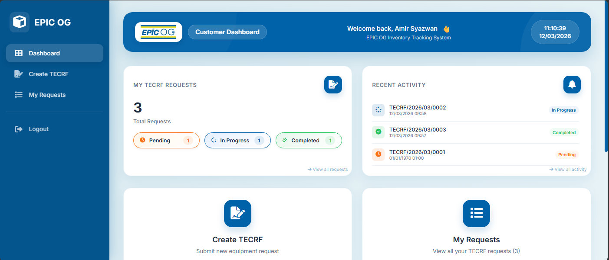
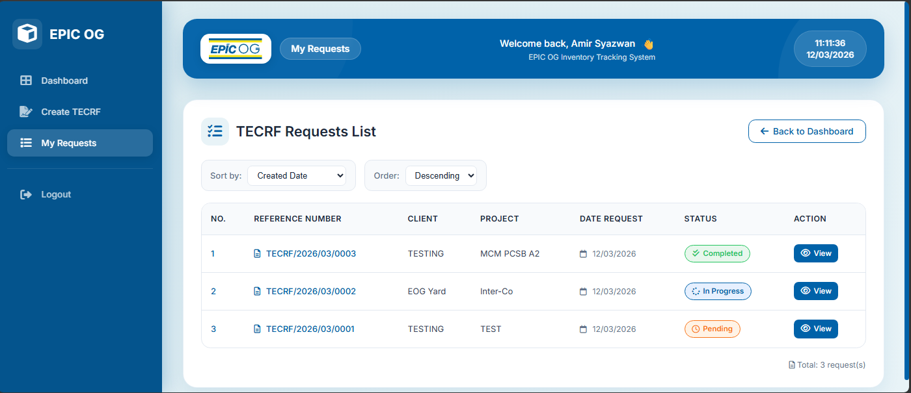
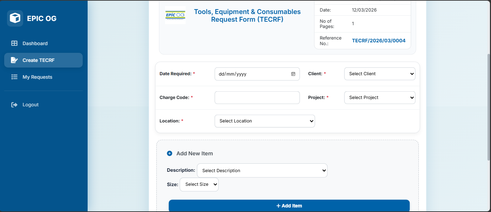

EPIC OG Inventory Management System

Overview

The EPIC OG Inventory Management System is a web-based application developed to record, monitor, and manage inventory items efficiently within an organization.

The system was developed for EPIC OG Sdn Bhd to help streamline inventory operations, improve tracking of equipment and tools, and simplify the management of requisition processes.

By centralizing inventory data, the system allows different user roles to access and manage inventory information according to their responsibilities.

User Roles

The system supports four different user roles with specific access levels:

• AdminIT – Manages system configuration, technical administration, and overall system maintenance

• AdminStaff – Handles inventory records, approvals, and operational management

• Staff – Submits inventory requests and views assigned equipment

• Client – Accesses inventory-related information and request updates

System Functions

Equipment & Tools Tracking

• Record inventory items

• Monitor equipment status

• Track inventory availability and usage

TECRF & Requisition Processing

• Submit equipment requests

• Manage TECRF documentation

• Process and approve requisitions

Reports & Notifications

• Generate inventory reports

• Monitor inventory activities

• Receive notifications for updates and requests

Technologies Used

Component	Technology

• Frontend	: HTML, CSS, JavaScript

• Backend :	PHP

• Database	: MySQL

Installation Guide

1. Clone the Repository
   
3. git clone https://github.com/ZersssR/epic-og-inventory-system.git
   
5. Move Project to Local Server

Place the project folder inside your local server directory.

Example:

XAMPP

htdocs/inventory-tracking-system

Laragon

www/inventory-tracking-system

3. Import Database

Open phpMyAdmin

Create a new database (example: inventory_tracking)

Import the provided SQL file

4. Run the System

Start your local server and open:

http://localhost/inventory-tracking-system

Project Purpose

• This system was developed as part of an industrial training project to improve the efficiency of inventory management and operational tracking within the organization.

Future Improvements

• Implement barcode or QR code inventory tracking

• Improve reporting and analytics features

• Add responsive mobile-friendly interface

• Enhance security and access control

Screenshots

Author

Syu

Bachelor of Computer Science (Software Development)

